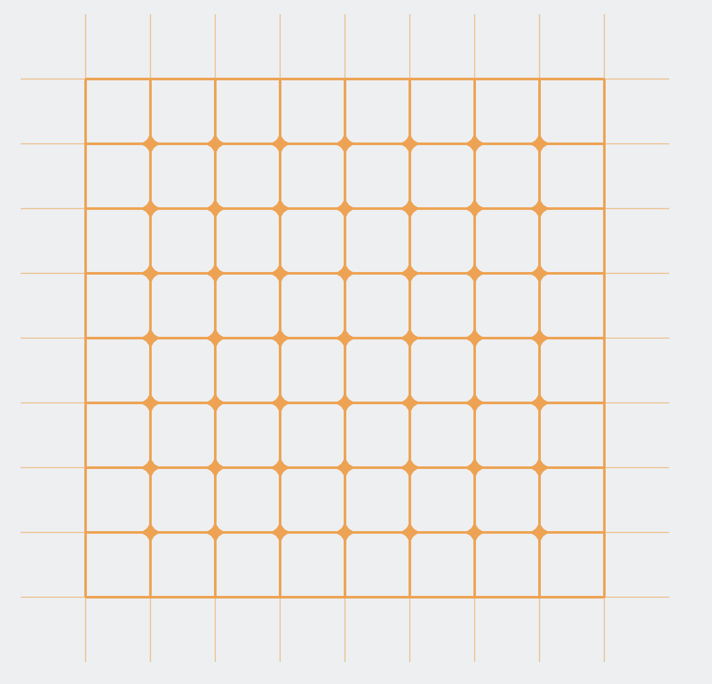
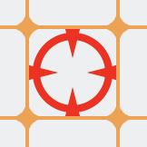

# Поймай меня, если сможешь...

## Доска 8 на 8 

## Король
 

## Ладья

Король не видит ладью но знает в какую сторону она пошла в свой ход. Ладья видит все но может перемещаться только в 
соседние по стороне клетки. Ладья ходит первой. 
### Что нужно сделать
Нужно реализовать ладью [Rook](src/main/java/domain/RookImpl.java), которая будет рандомно убегать от короля 
в свободную клетку в пределах доски

Нужно реализовать короля [King](src/main/java/domain/KingImpl.java), который всегда сможет поймать ладью за конечное число ходов

### Перед началом убедиться, что проект запускается :
Зайди в [Main](src/main/kotlin/Main.kt) - если все ок, то должна появиться зеленая стрелочка
возле `fun main() = application {`
